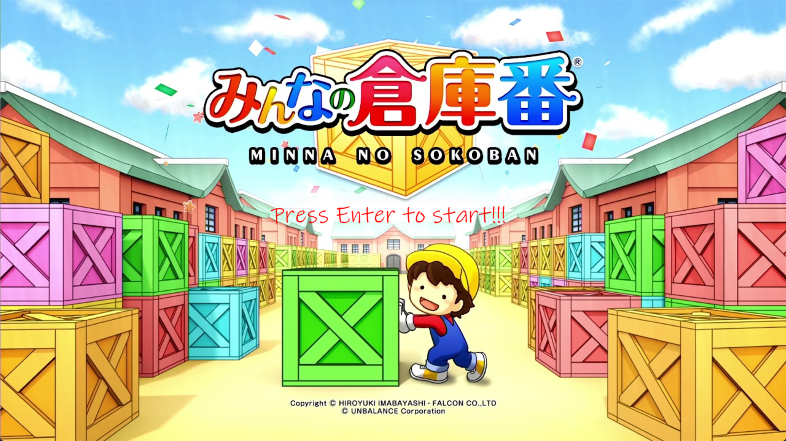
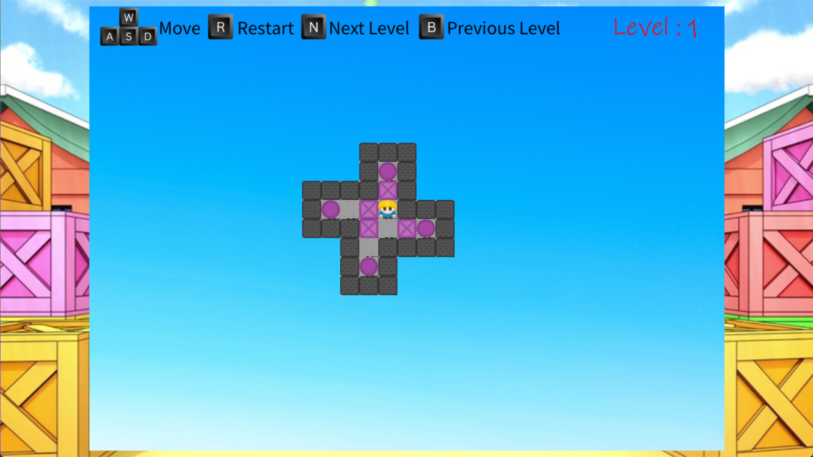

# 2025 OOPL Final Report

## 組別資訊

組別：
- 42 組
組員：
- 110580041 陳士堯
- 110590062 陳世軒
復刻遊戲： 
- 倉庫番（Sokoban）

## 專案簡介

### 遊戲簡介
推箱子（Sokoban）是一款經典的益智遊戲，玩家需要控制角色在倉庫內移動箱子，將其推到指定位置。遊戲的目標是透過最少的步數完成所有關卡，挑戰玩家的邏輯思維與空間規劃能力。
### 組別分工
- 陳士堯: 遊戲邏輯實作,關卡設計
- 陳世軒: 素材收集 ,UI設計

## 遊戲介紹

### 遊戲規則
### 遊戲畫面
 
 
 
## 程式設計

### 程式架構
### 程式技術

## 結語

### 問題與解決方法
### 自評

| 項次 | 項目                   | 完成 |
|------|------------------------|-------|
| 1    | 這是範例 |  V  |
| 2    | 完成專案權限改為 public |    |
| 3    | 具有 debug mode 的功能  |    |
| 4    | 解決專案上所有 Memory Leak 的問題  |    |
| 5    | 報告中沒有任何錯字，以及沒有任何一項遺漏  |    |
| 6    | 報告至少保持基本的美感，人類可讀  |    |

### 心得
### 貢獻比例
