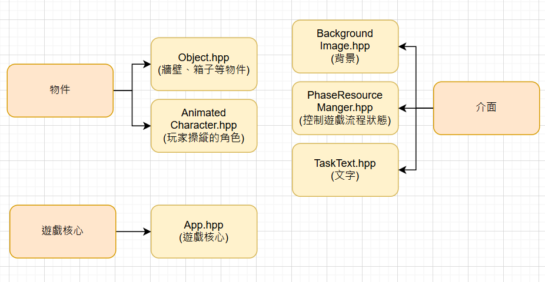

# 2025 OOPL Final Report

## 組別資訊

組別：

- 42 組

組員：

- 110580041 陳士堯
- 110590062 陳世軒

復刻遊戲： 

- 倉庫番（Sokoban）

## 專案簡介

### 遊戲簡介

推箱子（Sokoban）是一款經典的益智遊戲，玩家需要控制角色在倉庫內移動箱子，將其推到指定位置。遊戲的目標是透過最少的步數完成所有關卡，挑戰玩家的邏輯思維與空間規劃能力。

### 組別分工

- 陳士堯: 遊戲邏輯實作,關卡設計 50%
- 陳世軒: 素材收集 ,UI設計 50%

## 遊戲介紹

### 遊戲規則

推箱子是一款十分經典的遊戲，遊戲主要操控一個小人把箱子推進目標點就可以了。但是如果箱子移動的方向中有牆壁或是其他箱子是不能推動的。所以這個遊戲是考驗玩家的操縱能力以及對空間的觸覺。
遊戲共有40關。每當完成一關事就會馬上轉移至下一關上。每關難度十分感人。如果發現自己不能通關時可以使用密技。來快速跳關。達到快速完成40關的效果。

### 遊戲畫面

 
 
 
 
## 程式設計

### 程式架構
在這次實習，我們將類別分為物件、介面、遊戲核心三大類。

### 程式技術
在這次實作中學習與研究到了許多技術，讓這個遊戲的開發更加順利，以下將會帶來一個比較重要的技術。
-關卡資料的來源設計
關卡資料移出程式本體，改為從外部 .txt 檔案中讀取關卡資訊。這樣不但讓程式更模組化，也大大提升了遊戲的可擴充性與彈性。 我們的解決方法如下： 定義簡單易懂的文字格式，例如使用特定符號表示地圖元素（'1' 表示牆壁，'4' 表示箱子，'2' 表示角色等等）。 在遊戲啟動時，讀取指定的 .txt 檔案，逐行讀取並轉換為地圖的二維陣列資料結構。 依照每個符號對應的遊戲物件來初始化地圖，例如讀到 '2'  就在該位置建立角色物件，'4' 讀到就放一個箱子。 若需要更換關卡，只要載入不同的 .txt 檔即可，程式邏輯完全不需要更動。 這樣的設計讓我們的遊戲更加彈性，也讓關卡設計變成一件可以獨立進行的工作。

## 結語

### 問題與解決方法
在這次實作中遇到了很多問題，但也都成功排除了。
- 角色朝向變化的處理邏輯

在開發推箱子遊戲的過程中，遇到一個需要特別處理的問題：當玩家操作角色改變朝向時，角色的外觀（例如面向上、下、左、右的圖片）需要即時更新。但由於我們在設計角色時，是以物件的形式存在於遊戲地圖中的特定座標，若直接修改角色的外觀，會導致畫面更新異常或資料狀態錯亂。 一開始我們嘗試在原物件上直接修改角色的朝向屬性與圖片資源，但發現這樣容易造成角色的狀態無法即時反映在畫面上，甚至在某些情況下導致角色消失或出現在錯誤位置。後來我們仔細檢查了更新邏輯，意識到應該要「完整重建角色物件」才能確保狀態與畫面同步一致。 因此，我的解決方法是： 先記錄角色當前的位置座標（X, Y），並確認角色正在改變的是「朝向」而不是位置。 將原本的角色物件從地圖資料結構中移除，即進行一次解構或清除的動作。 依照新的朝向參數，重新建構一個角色物件，設定正確的圖片資源與方向屬性。 將新角色物件放置回原來的位置，並更新地圖上的資料與畫面。 這樣的處理方式雖然多了一點步驟，但能夠有效避免狀態錯誤，同時保持畫面的正確性。這也讓我更深入理解到物件導向設計中「狀態一致性」與「物件再建構」的重要性。 透過這個問題的解決，我學會了在面對動態物件變化時，應該要清楚地區分「狀態更新」與「重新建構」的時機，這對日後設計更多互動性高的遊戲或應用都會有很大的幫助。

在一開始設計推箱子遊戲時，我們為了方便開發與測試，是直接在程式碼中定義關卡資料，例如使用二維陣列在程式中寫死每一格的內容（牆壁、地板、箱子、目標點、角色等）。雖然這種方式在初期實作上比較直觀快速，但後來我們發現這種寫法有以下幾個缺點：
- 關卡資料與邏輯混在一起，不利於維護或修改。
- 不方便新增關卡，每次都必須進入原始碼中修改，風險高且容易出錯。
- 不具擴充性，無法讓其他人（例如非程式設計者）參與關卡設計。
基於上述問題，我們決定將關卡資料移出程式本體，改為從外部 .txt 檔案中讀取關卡資訊。這樣不但讓程式更模組化，也大大提升了遊戲的可擴充性與彈性。

### 自評

| 項次 | 項目                   | 完成 |
|------|------------------------|-------|
| 1    | 這是範例 |  V  |
| 2    | 完成專案權限改為 public |  V  |
| 3    | 具有 debug mode 的功能  |  V  |
| 4    | 解決專案上所有 Memory Leak 的問題  |  V  |
| 5    | 報告中沒有任何錯字，以及沒有任何一項遺漏  |  V  |
| 6    | 報告至少保持基本的美感，人類可讀  |  V  |

### 心得

- 陳士堯:

 在這次 OOPL 的課程專案中，我選擇了「推箱子遊戲」作為題目，這個看似簡單的小遊戲，其實蘊含了許多邏輯細節與程式設計技巧。整個過程讓我真正體會到「從零開始」打造一個完整應用的成就感。一開始我花了很多時間在規劃整體架構，特別是如何用物件導向的方式去抽象出遊戲中的各種角色與行為。這次專案讓我學會了如何把程式模組化，像是角色移動、地圖載入、遊戲狀態檢查等功能分別設計在不同的類別中，大大提升了程式的可讀性。雖然過程不乏困難，常常一個小錯誤就會導致整個遊戲無法正常運作。但也正是透過不斷地測試與修正，讓我更了解程式執行流程以及除錯技巧。
 完成專案後，看到自己的遊戲可以順利運行，甚至能設計自己的關卡，真的非常有成就感。這次經驗不只是對程式技巧的提升，也讓我對未來繼續學習與開發遊戲充滿動力。

- 陳世軒:

 這次在 OOPL 課程中完成推箱子遊戲的專案，對我來說是一次非常寶貴的經驗。從一開始的規劃、設計類別架構，到實作過程中的各種 bug 排除，我深刻體會到物件導向程式設計的強大與實用。在專案中，我將地圖、角色、箱子等元素各自設計成不同的類別，並透過繼承與封裝讓整體架構更清晰。在面對移動判斷、關卡判定等邏輯時，花了不少時間思考如何讓程式碼更具可讀性與可維護性。雖然過程中也曾遇到卡關，像是處理邊界碰撞或箱子堆疊的邏輯，但在不斷嘗試與調整下，最終成功完成遊戲的核心功能。
透過這次專案，我不僅加深了對 OOP 的理解，也提升了解決問題與除錯的能力。未來如果要做更複雜的專案，我相信這次的經驗會成為我重要的基礎。

### 貢獻比例
- 陳士堯: 50%
- 陳世軒: 50%
