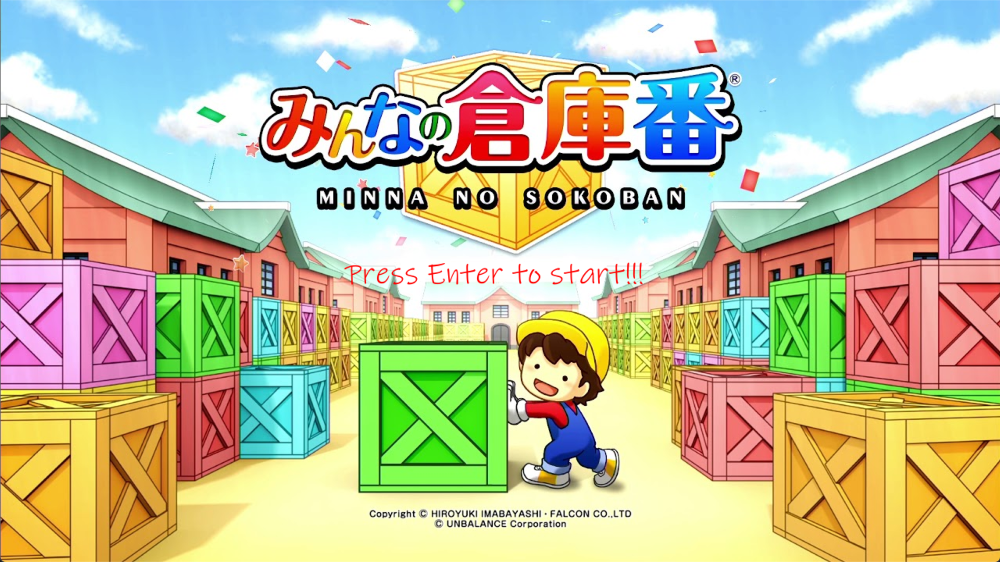
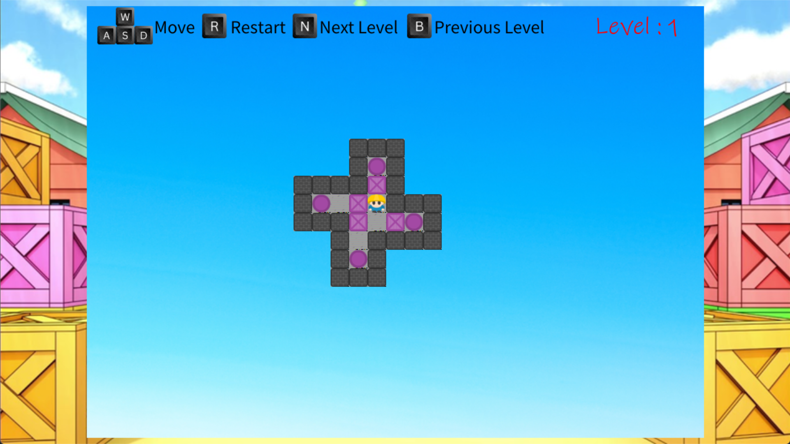
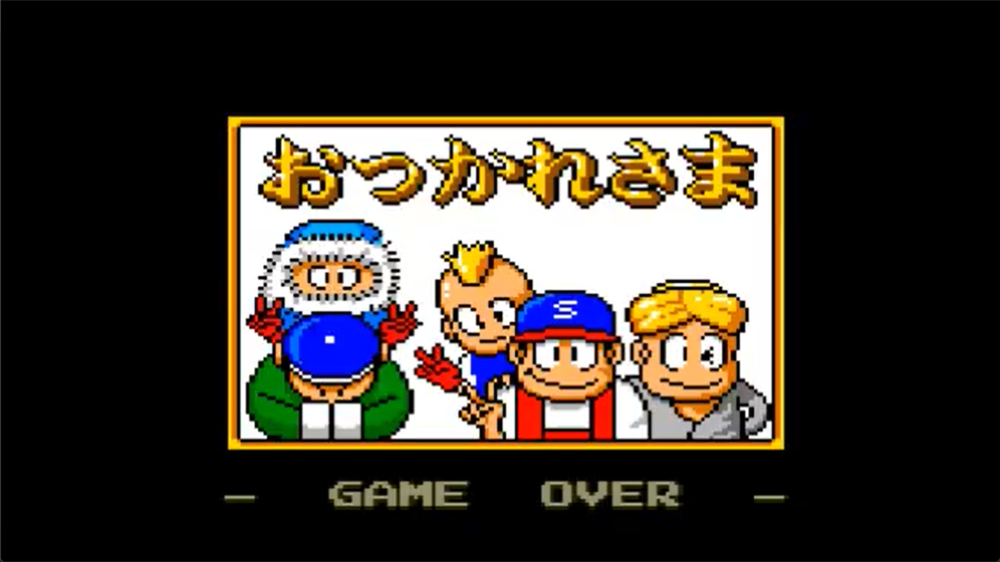

# 2025 OOPL Final Report

## 組別資訊

組別：

- 42 組

組員：

- 110580041 陳士堯
- 110590062 陳世軒

復刻遊戲： 

- 倉庫番（Sokoban）

## 專案簡介

### 遊戲簡介

推箱子（Sokoban）是一款經典的益智遊戲，玩家需要控制角色在倉庫內移動箱子，將其推到指定位置。遊戲的目標是透過最少的步數完成所有關卡，挑戰玩家的邏輯思維與空間規劃能力。

### 組別分工

- 陳士堯: 遊戲邏輯實作,關卡設計 50%
- 陳世軒: 素材收集 ,UI設計 50%

## 遊戲介紹

### 遊戲規則

推箱子是一款十分經典的遊戲，遊戲主要操控一個小人把箱子推進目標點就可以了。但是如果箱子移動的方向中有牆壁或是其他箱子是不能推動的。所以這個遊戲是考驗玩家的操縱能力以及對空間的觸覺。
遊戲共有40關。每當完成一關事就會馬上轉移至下一關上。每關難度十分感人。如果發現自己不能通關時可以使用密技。來快速跳關。達到快速完成40關的效果。

### 遊戲畫面

 
 
 
 
## 程式設計

### 程式架構
在這次實習，
### 程式技術

## 結語

### 問題與解決方法
在這次實作中遇到了很多問題，但也都成功排除了。

### 自評

| 項次 | 項目                   | 完成 |
|------|------------------------|-------|
| 1    | 這是範例 |  V  |
| 2    | 完成專案權限改為 public |  V  |
| 3    | 具有 debug mode 的功能  |  V  |
| 4    | 解決專案上所有 Memory Leak 的問題  |  V  |
| 5    | 報告中沒有任何錯字，以及沒有任何一項遺漏  |  V  |
| 6    | 報告至少保持基本的美感，人類可讀  |  V  |

### 心得

- 陳士堯:
 在這次 OOPL 的課程專案中，我選擇了「推箱子遊戲」作為題目，這個看似簡單的小遊戲，其實蘊含了許多邏輯細節與程式設計技巧。整個過程讓我真正體會到「從零開始」打造一個完整應用的成就感。一開始我花了很多時間在規劃整體架構，特別是如何用物件導向的方式去抽象出遊戲中的各種角色與行為。這次專案讓我學會了如何把程式模組化，像是角色移動、地圖載入、遊戲狀態檢查等功能分別設計在不同的類別中，大大提升了程式的可讀性。雖然過程不乏困難，常常一個小錯誤就會導致整個遊戲無法正常運作。但也正是透過不斷地測試與修正，讓我更了解程式執行流程以及除錯技巧。
 完成專案後，看到自己的遊戲可以順利運行，甚至能設計自己的關卡，真的非常有成就感。這次經驗不只是對程式技巧的提升，也讓我對未來繼續學習與開發遊戲充滿動力。

- 陳世軒:
 這次在 OOPL 課程中完成推箱子遊戲的專案，對我來說是一次非常寶貴的經驗。從一開始的規劃、設計類別架構，到實作過程中的各種 bug 排除，我深刻體會到物件導向程式設計的強大與實用。在專案中，我將地圖、角色、箱子等元素各自設計成不同的類別，並透過繼承與封裝讓整體架構更清晰。在面對移動判斷、關卡判定等邏輯時，花了不少時間思考如何讓程式碼更具可讀性與可維護性。雖然過程中也曾遇到卡關，像是處理邊界碰撞或箱子堆疊的邏輯，但在不斷嘗試與調整下，最終成功完成遊戲的核心功能。
透過這次專案，我不僅加深了對 OOP 的理解，也提升了解決問題與除錯的能力。未來如果要做更複雜的專案，我相信這次的經驗會成為我重要的基礎。

### 貢獻比例
- 陳士堯: 50%
- 陳世軒: 50%
